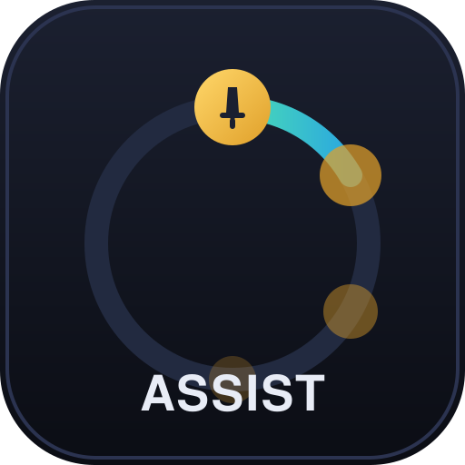

<p align="center">
  
</p>

<h1 align="center">Tuono</h1>

<p align="center">
  <strong>A configurable rotation-helper framework for World of Warcraft: Midnight (12.0+)</strong><br>
  Legal by construction. Reads no hidden state. Never presses a button for you.
</p>

<p align="center">
  <a href="#quick-start">Quick start</a> ·
  <a href="#secrets-did-not-remove-these-tools-they-privatized-them">The argument</a> ·
  <a href="#what-is-actually-readable">What is readable</a> ·
  <a href="#how-this-stays-legal">How this stays legal</a> ·
  <a href="docs/INVERSION.md">The maths</a> ·
  <a href="docs/PROFILES.md">Write a profile</a>
</p>

---

## Secrets did not remove these tools. They privatized them.

Midnight's **secret values** system hid the combat state that rotation addons were built
on. The stated goal was to end the era of addons playing the game for you.

Here is the part worth being precise about: **this repository reads no protected value and
automates no input, and it reconstructs most of what was hidden anyway.** Not by defeating
anything — by ordinary engineering. Energy is bounded by inverting a never-secret
"can I cast this?" boolean. Cooldowns are rebuilt from your own cast events. Procs are read
off the activation-glow the client already draws for you. None of that touches a secret;
it is arithmetic on things Blizzard deliberately left readable, and a human does a rougher
version of it in their head every pull.

So the barrier that went up was never a wall. It was **effort**. And an effort barrier does
not remove capability from the game — it decides *who keeps it*.

What actually happened is that the free, open, community-audited addons died, because a
volunteer maintaining a spec list for free does not also sign up to write an interval
arithmetic energy model. What replaces them is Blizzard's own assistant — a flat priority
that ignores your buffs and costs some specs 25–30% of their damage — or private tools:
closed source, unaudited, passed around in Discords and paid servers, by exactly the people
motivated enough to rebuild them.

The players who lose are the ones who were never the problem. Casual players who used a
helper to keep up. **Players who relied on these tools for accessibility** — motor
impairments, cognitive load, chronic pain — and who woke up to no substitute and no
migration path. They are not in the private Discords. They just stopped having the thing.

That is the actual outcome, and it is not a fair one. A hidden value is only hidden from
people who will not do the work.

**So this is open.** MIT, auditable, every technique documented, every uncertainty rendered
honestly on screen instead of being papered over. If the capability is going to exist
either way — and it is — then it should exist where anyone can read it, check it, and use
it, not only where someone is selling it.

None of that is a complaint about players wanting fair play, and none of it is an argument
for cheating. It is an argument that **hiding data from an API mostly relocates a
capability rather than removing it**, and that the relocation has a cost somebody pays.

---

## What this is

A framework for building rotation helpers out of the data that is still legally readable,
with your own priority logic layered on top.

- **A rolling wheel of your next four presses**, including repeats. If the honest answer
  is "builder four times", you see four icons — and if the fourth step depends on
  something Midnight hides, the wheel ends before it. The length of the strip is itself
  the confidence signal.
- **Two rotations, one bar.** Single-target and AoE lists switch automatically on live
  enemy count, with hysteresis so the bar cannot strobe.
- **An in-game rule editor.** Ordered priority rows, first match wins, no Lua required.
- **Profiles.** Outlaw Rogue ships as the worked example. Any spec can be added as data.
- **Honesty about uncertainty.** Values Midnight hides are shown as estimates, never as
  measurements. The display dims, shortens, and admits doubt rather than guessing at you.

> **Status:** 183 behavioural tests plus 77 secret-value regressions, all passing, against
> a harness that emulates secret values. Validated on a live 12.1.0 client in open-world
> play: the immediate recommendation reads as optimal, and energy — a value the client
> refuses to return at all — is held to a **mean interval width of 2.76 out of 100**. The
> lookahead beyond the next press is right about half the time and truncates itself when it
> cannot justify a step. **Not** yet validated inside a mythic keystone — see
> [Help wanted](#help-wanted).

---

## Quick start

1. Clone this repository and copy the inner `Tuono/` folder into
   `World of Warcraft\_retail_\Interface\AddOns\`. There is no packaged release yet.
2. **Check the nesting.** You need `Interface\AddOns\Tuono\Tuono.toc`, *not*
   `Interface\AddOns\Tuono\Tuono\Tuono.toc`. Move the inner folder up if so.
3. **It may show as "out of date."** Tick **Load out of date AddOns** in the Addons pane
   before entering the world.
4. In game: `/tuono config` opens the editor; `/tuono secrets` audits what your client is
   actually exposing right now.

### Upgrading from OutlawAssist

Tuono is OutlawAssist renamed. WoW keys saved variables to the addon folder, so the rename
would otherwise look like a fresh install and lose your bar position, scale, glow settings
and any edited priority rows.

**Keep the old `OutlawAssist` folder in place for one login.** On first load Tuono reads its
saved variables, imports them, and tells you in chat what it carried. After that you can
delete the old folder. The import runs once and will never overwrite settings you have
already changed in Tuono.

---

## What is actually readable

Blizzard did not hide *everything*, and the difference is the whole design space. Measured
against a live 12.1.0 client and Blizzard's generated API documentation:

| Value | Readable in combat / M+? |
|---|---|
| **Combo points** and other secondary resources | ✅ yes |
| **Cooldown readiness** (`isEnabled` / `isActive` / `isOnGCD`) | ✅ yes — flagged never-secret |
| `C_Spell.IsSpellUsable` → `isUsable`, `insufficientPower` | ✅ yes — never-secret, and load-bearing |
| **Trinket cooldowns** | ✅ yes |
| **Enemy count** (nameplates + threat) | ✅ yes |
| `IsStealthed`, `GetTime` | ✅ yes |
| `C_AssistedCombat.GetNextCastSpell` | ✅ yes — plain spellID |
| **Energy** and other primary resources | ❌ **secret unconditionally** |
| `GetHaste` | ❌ secret since 12.0.5 — cached from the last out-of-combat read |
| Cooldown *remaining* (`startTime` / `duration`) | ❌ secret in combat, encounters, keystones, PvP |
| Aura payloads (`UNIT_AURA`, aura-by-index) | ❌ secret; the index path **raises** |
| Enemy health, buffs, casts | ❌ secret |

Run `/tuono secrets` in a city, on a dummy, and mid-pull in a keystone. Blizzard flips these
between builds — documentation is a hypothesis, that command is the measurement.

### Readiness survives, and that is most of a rotation

`isEnabled`, `isActive` and `isOnGCD` are never-secret even when the *timer* is hidden. You
can know **whether** an ability is ready in a keystone; you just cannot know for how much
longer. Most rotation logic only needs the boolean.

### Energy is bounded, not read

Energy has no legal read path, so the addon stops trying and **bounds** it instead. It
carries an interval `[lo, hi]`: elapsed time widens it, and every never-secret observation
tightens it — chiefly `IsSpellUsable`'s `insufficientPower`, which turns each ability's cost
into a threshold you can watch the true value cross. Affordability answers yes, no, or
**maybe**, and "maybe" is rendered as maybe.

**Measured on a live 12.1.0 client: mean interval width 2.76 out of a 0–100 range, across
113 in-combat ticks**, with exact zero-width pins at every threshold crossing. That is a
value the client refuses to return, held to under 3% of its range for the whole fight,
using nothing it declined to tell us. It got there in three steps — 7.13 → 3.44 → 2.76 —
as the crossing solve, an out-of-combat regen seed and per-buff provenance each landed.

That is the general shape of everything here:

> **You never need to read the hidden value. You need any never-secret *function* of it,
> and then you invert.**

You never invert to a number — you invert to a *set*, and accuracy is the size of the
intersection of every constraint you have. Two documents, both written to be useful whether
or not you use this addon:

- **[docs/SECRET-VALUES-FINDINGS.md](docs/SECRET-VALUES-FINDINGS.md)** — what is and is not
  readable, measured against a live client, and the four practical techniques.
- **[docs/INVERSION.md](docs/INVERSION.md)** — the mathematics. Interval arithmetic as a
  set-membership filter, why threshold *crossings* are exact measurements where threshold
  *levels* are coarse, how two crossings solve a rate without ever knowing the value, and
  why an estimator that fully converges will eventually lie to you.

---

## How this stays legal

- **Reads no hidden state.** Every API return passes a readability check before use; where
  a value is hidden, the addon says so on screen.
- **No input automation.** It displays suggestions. You press the button. There is no code
  path that casts anything.
- **Fails toward honesty.** Unreadable never silently becomes zero. That distinction is the
  whole design — the original bug in this addon was `num(UnitPower(...), 0)` turning "I
  cannot read your energy" into a confident "you have no energy", which emptied the rotation
  and froze the bar.

Blizzard's position is that rotation helpers are not inherently harmful; what is disallowed
is reading the hidden state. This does not.

One caveat stated plainly, because pretending otherwise would be dishonest: bounding a
hidden scalar with a never-secret boolean is a *declassification channel*, and Blizzard has
narrowed that class of thing before. If they flag `IsSpellUsable`, the energy model degrades
to `[0, max]`, every affordability question becomes "maybe", and the rotation falls back to
combo points and cooldowns on its own. That is designed for, not patched around — see
[docs/SECRET-VALUES-FINDINGS.md](docs/SECRET-VALUES-FINDINGS.md).

---

## Commands

| Command | What it does |
|---|---|
| `/tuono config` | Open the rotation editor — profile selector, priority rows, AoE mode |
| `/tuono secrets` | Audit which values are readable right now, plus active restriction contexts |
| `/tuono aoe` | Cycle AoE handling: `auto` / `on` / `off` |
| `/tuono icons <1-8>` | Maximum upcoming presses to show (the queue may show fewer) |
| `/tuono record` | Flight recorder → SavedVariables; `stop`, `auras`, `auto`, `status` |
| `/tuono unlock` / `/tuono lock` | Move the bar |
| `/tuono scale <0.5-2>` | Resize |
| `/tuono glow` | Toggle the action-bar highlight |
| `/tuono toggle <queue\|ooc>` · `/tuono reset` · `/tuono status` | Display toggles and state |
| `/tuono debug` · `/tuono apitest` · `/tuono watch` · `/tuono probe` | Diagnostics |

`/tu` and `/oa` are aliases for `/tuono`.

### Reporting a bug usefully

`/tuono record`, play, then `/reload` — that flush is what writes the trace to disk. Then
`lua tools/read_trace.lua <path-to-SavedVariables/Tuono.lua>` prints what the addon
believed, what the client refused, and which casts failed. Attaching that output to an issue
turns "the bar is wrong" into something fixable.

---

## Architecture

```
Core            event dispatch, secret-value primitives (readNum/readBool)
Profiles        registry; owns Tuono.SpellIDs, resolves renumbered spell aliases
profiles/*      per-spec data: spells, costs, priority lists   <-- add yours here
UserRules       editable priority rows -> compiled predicates
StateTracker    readable state only, with knownness flags
EnergyModel     interval energy: bounded by IsSpellUsable threshold crossings
CooldownModel   cooldown + GCD reconstruction from the cast stream
Observers       aura channels: overlay glow, never-secret whitelist, cardinality
AssistReader    C_AssistedCombat, secret-safe; a drift sensor, never an icon
Rotation        spec-agnostic forward simulation, AoE/ST selection, provenance rating
IntelligenceLayer  queue assembly, castability filtering, confidence truncation
Display         the wheel      Highlight  action-bar glow
Options         in-game editor  Secrets   readability audit  Recorder  flight recorder
```

**Adding a spec is a data change, not a code change.** See
**[docs/PROFILES.md](docs/PROFILES.md)** — it covers the rule schema, the helper API, and
the one genuinely subtle part: choosing which way each rule should fail when a value is
unreadable.

---

## Help wanted

This is the part where the project needs other people, honestly:

- **Live-client validation.** Run `/tuono secrets` in a keystone and open an issue with the
  output. The readability table above comes from one character on one build; real
  measurements from real content beat that.
- **Profiles for other specs.** Outlaw is the example, not the point. If you main something
  else and can write its priority list, that is the highest-value contribution available.
- **Accessibility feedback.** If you used a helper because of a motor or cognitive
  impairment and this does not work for you, that is a bug report, and a high-priority one.
- **Anyone who has read the secret-values rules closely.** If something here is legally
  wrong, say so loudly and I will fix it.

Issues and PRs: <https://github.com/matt82198/Tuono/issues>

---

## Development

```bash
lua tests/run_tests.lua           # 183 behavioural tests (also runs the two lints)
lua tests/secrets_regression.lua  #  77 assertions against emulated secret values
lua tests/migration_test.lua      #   8 tests for the OutlawAssist import path
lua tests/toc_check.lua           #   TOC / CHANGELOG / file-manifest drift gate
lua tests/lua51_check.lua         #   Lua 5.1 syntax gate (the WoW runtime)
```

The suite is **mutation-checked**: every fix is confirmed to turn its covering test red
against the broken code before being called done. A test that only passes proves nothing —
if you add one, break the thing it covers and watch it fail first.

---

## License

MIT. Take it, fork it, ship your own. That is the point.
